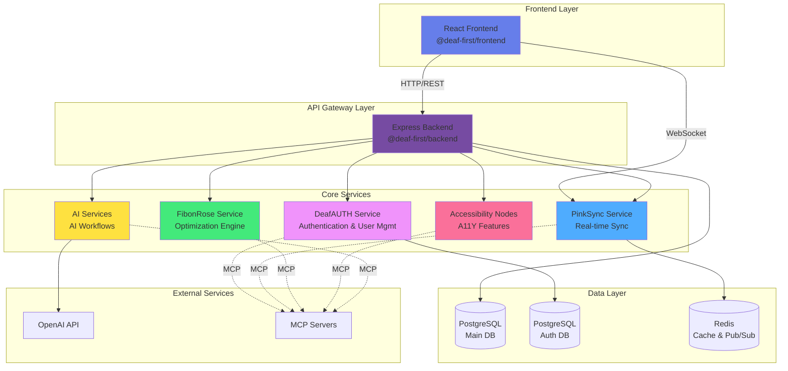
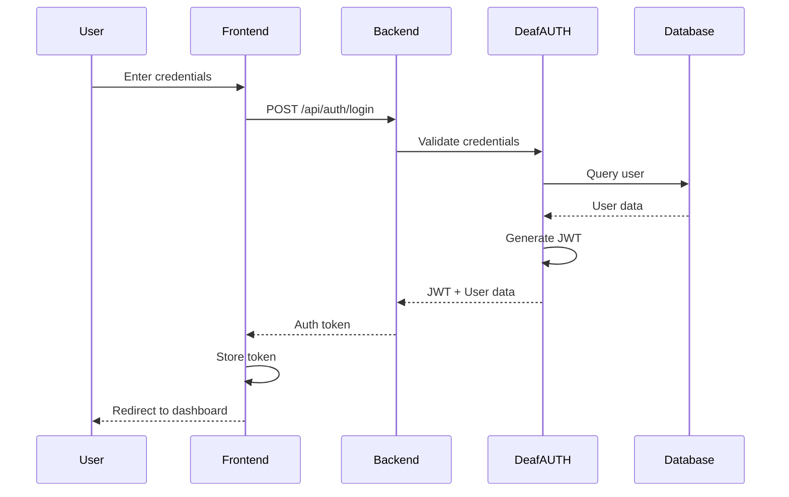
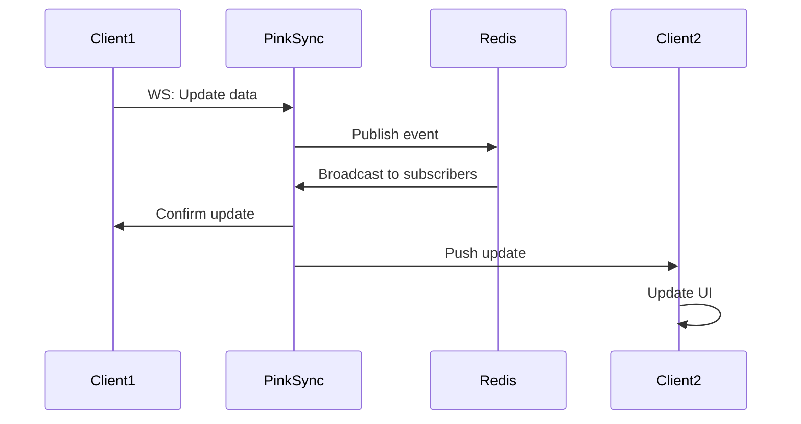
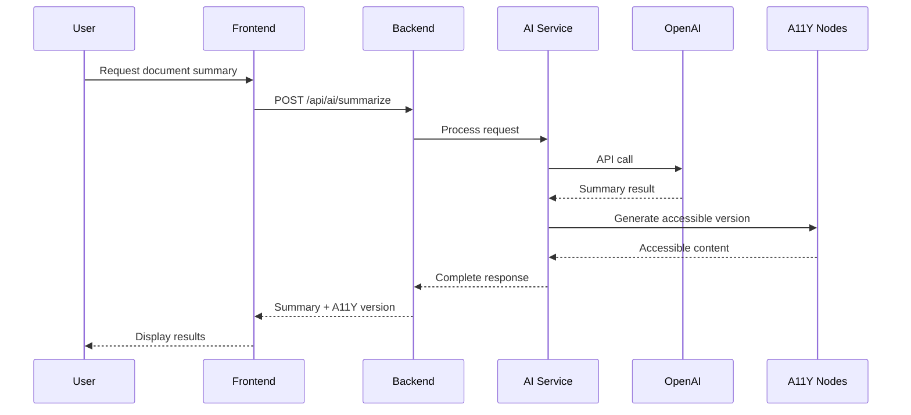

# DEAF-FIRST Platform Architecture

## Table of Contents
- [Overview](#overview)
- [System Architecture](#system-architecture)
- [Service Interconnections](#service-interconnections)
- [Data Flows](#data-flows)
- [AI Workflows](#ai-workflows)
- [Technology Stack](#technology-stack)
- [Deployment Architecture](#deployment-architecture)
- [Security Architecture](#security-architecture)

## Overview

The DEAF-FIRST Platform is a comprehensive, microservices-based SaaS ecosystem designed with accessibility as the primary focus. The architecture follows modern cloud-native patterns with emphasis on scalability, maintainability, and modularity.

### Core Design Principles

1. **Accessibility First**: Every component is designed with deaf and hard-of-hearing users in mind
2. **Modular Architecture**: Independent, loosely-coupled services that can be developed and deployed separately
3. **Real-time Communication**: WebSocket-based synchronization for instant updates
4. **AI-Powered**: Intelligent workflows and automation throughout the platform
5. **MCP Protocol**: Model Context Protocol integration for AI service communication

## System Architecture



## Service Interconnections

### Frontend (@deaf-first/frontend)
- **Technology**: React 18, TypeScript, Vite
- **Port**: 5173 (dev), 80/443 (prod)
- **Dependencies**: Backend API, PinkSync WebSocket
- **Responsibilities**:
  - User interface rendering
  - Accessibility features (WCAG 2.1 AAA)
  - Real-time UI updates
  - Sign language support integration

**API Connections**:
- `GET/POST /api/*` → Backend REST API
- `WS /ws` → PinkSync WebSocket connection

### Backend (@deaf-first/backend)
- **Technology**: Express.js, TypeScript, PostgreSQL
- **Port**: 3000
- **Dependencies**: All microservices, PostgreSQL, JWT
- **Responsibilities**:
  - API gateway and request routing
  - Business logic orchestration
  - Database operations
  - Webhook management
  - Authentication middleware

**Service Integration**:
```typescript
// Routes to services
/api/auth/* → DeafAUTH Service
/api/sync/* → PinkSync Service
/api/optimize/* → FibonRose Service
/api/accessibility/* → Accessibility Nodes
/api/ai/* → AI Services
/api/webhooks/* → Webhook handlers
```

### DeafAUTH Service (@deaf-first/deafauth)
- **Technology**: Express.js, TypeScript, PostgreSQL, JWT
- **Port**: 3002
- **Database**: Dedicated PostgreSQL instance
- **Responsibilities**:
  - User authentication (JWT-based)
  - User registration and profile management
  - Accessibility preferences storage
  - Session management
  - MCP server for auth operations

**API Endpoints**:
- `POST /auth/register` - User registration
- `POST /auth/login` - User login
- `GET /auth/profile` - Get user profile
- `PUT /auth/preferences` - Update accessibility preferences
- `POST /auth/refresh` - Refresh JWT token

**MCP Operations**:
- User creation and management
- Authentication status checks
- Permission validation

### PinkSync Service (@deaf-first/pinksync)
- **Technology**: WebSocket, Redis Pub/Sub, TypeScript
- **Port**: 3003
- **Dependencies**: Redis
- **Responsibilities**:
  - Real-time data synchronization
  - WebSocket connection management
  - Event broadcasting
  - State synchronization across clients
  - MCP server for sync operations

**Event Types**:
- `user.update` - User data changes
- `document.change` - Document modifications
- `notification.new` - New notifications
- `presence.change` - User presence updates

**Architecture**:
```
Client 1 → WebSocket → PinkSync → Redis Pub/Sub → PinkSync → WebSocket → Client 2
```

### FibonRose Service (@deaf-first/fibonrose)
- **Technology**: TypeScript, Mathematical algorithms
- **Port**: 3004
- **Responsibilities**:
  - Fibonacci-based scheduling optimization
  - Performance analytics
  - Resource allocation optimization
  - Load balancing calculations
  - MCP server for optimization queries

**Optimization Algorithms**:
- Fibonacci heap for priority queues
- Golden ratio-based scheduling
- Performance metric calculations
- Resource distribution optimization

### Accessibility Nodes (@deaf-first/accessibility-nodes)
- **Technology**: TypeScript, Various A11Y libraries
- **Port**: 3005
- **Responsibilities**:
  - Sign language interpretation APIs
  - Visual accessibility enhancements
  - Screen reader optimization
  - WCAG compliance validation
  - MCP server for accessibility APIs

**Features**:
- Text-to-sign-language conversion
- Visual contrast optimization
- Closed captioning generation
- Audio description synthesis
- Keyboard navigation enhancement

### AI Services (@deaf-first/ai)
- **Technology**: TypeScript, OpenAI API
- **Port**: 3006
- **Dependencies**: OpenAI API
- **Responsibilities**:
  - Natural language processing
  - Sign language generation
  - Workflow automation
  - Content simplification
  - MCP server for AI operations

**AI Workflows**:
- Document summarization
- Text simplification for accessibility
- Sign language avatar generation
- Context-aware assistance

## Data Flows

### User Authentication Flow



### Real-time Synchronization Flow



### AI Processing Flow



## AI Workflows

### Document Processing Workflow

1. **Input**: User uploads document
2. **OCR**: Extract text content
3. **Analysis**: AI Service analyzes content structure
4. **Simplification**: Generate simplified version
5. **Sign Language**: Create sign language interpretation
6. **Output**: Multiple accessible formats

### Accessibility Enhancement Workflow

1. **Content Scan**: Analyze content for accessibility issues
2. **Issue Detection**: Identify WCAG violations
3. **Auto-Fix**: Apply automated fixes where possible
4. **AI Enhancement**: Use AI to improve content clarity
5. **Validation**: Verify WCAG compliance
6. **Report**: Generate accessibility report

### Real-time Assistance Workflow

1. **User Query**: User asks question via chat
2. **Context Gathering**: Collect relevant context
3. **AI Processing**: OpenAI generates response
4. **Accessibility Check**: Ensure response is accessible
5. **Sign Language**: Generate sign interpretation
6. **Multi-format Response**: Deliver in text + sign language

## Technology Stack

### Frontend Technologies
- **Framework**: React 18
- **Language**: TypeScript 5.7
- **Build Tool**: Vite 6.0
- **State Management**: TanStack Query
- **HTTP Client**: Axios
- **Styling**: CSS3 with modern features

### Backend Technologies
- **Runtime**: Node.js 20+
- **Framework**: Express.js
- **Language**: TypeScript 5.7
- **Database**: PostgreSQL 14+
- **Cache**: Redis 7+
- **Authentication**: JWT (jsonwebtoken)
- **Security**: Helmet, CORS

### DevOps & Infrastructure
- **Container**: Docker
- **Orchestration**: Docker Compose / Kubernetes
- **CI/CD**: GitHub Actions
- **Monitoring**: (To be implemented)
- **Logging**: (To be implemented)

### AI & ML
- **AI Provider**: OpenAI API
- **Protocol**: MCP (Model Context Protocol)
- **Frameworks**: Custom TypeScript implementations

## Deployment Architecture

### Development Environment

```
Developer Workstation
├── Frontend (localhost:5173)
├── Backend (localhost:3000)
├── DeafAUTH (localhost:3002)
├── PinkSync (localhost:3003)
├── FibonRose (localhost:3004)
├── Accessibility Nodes (localhost:3005)
└── AI Services (localhost:3006)
```

### Docker Compose Deployment

```yaml
services:
  frontend: { image: deaf-first-frontend, ports: [80:80] }
  backend: { image: deaf-first-backend, ports: [3000:3000] }
  deafauth: { image: deaf-first-deafauth, ports: [3002:3002] }
  pinksync: { image: deaf-first-pinksync, ports: [3003:3003] }
  fibonrose: { image: deaf-first-fibonrose, ports: [3004:3004] }
  accessibility: { image: deaf-first-a11y, ports: [3005:3005] }
  ai: { image: deaf-first-ai, ports: [3006:3006] }
  postgres: { image: postgres:14 }
  redis: { image: redis:7 }
```

### Production Architecture (Recommended)

```
Internet
  ↓
Load Balancer (HTTPS)
  ↓
├─ Frontend (Static CDN)
└─ API Gateway (Backend)
    ↓
    ├─ DeafAUTH Service (Auto-scaled)
    ├─ PinkSync Service (Auto-scaled)
    ├─ FibonRose Service (Auto-scaled)
    ├─ Accessibility Nodes (Auto-scaled)
    └─ AI Services (Auto-scaled)
        ↓
        ├─ PostgreSQL (Managed DB)
        ├─ Redis (Managed Cache)
        └─ Object Storage
```

## Security Architecture

### Authentication & Authorization

- **JWT-based Authentication**: Stateless token authentication
- **Token Refresh**: Secure token rotation mechanism
- **RBAC**: Role-based access control (to be implemented)
- **Session Management**: Redis-backed session storage

### Data Protection

- **Encryption at Rest**: Database encryption
- **Encryption in Transit**: TLS/HTTPS for all connections
- **Password Security**: bcrypt hashing with salt
- **API Security**: Helmet middleware, CORS policies

### Security Measures

1. **Input Validation**: All inputs validated and sanitized
2. **SQL Injection Prevention**: Parameterized queries
3. **XSS Prevention**: Content Security Policy headers
4. **CSRF Protection**: CSRF tokens for state-changing operations
5. **Rate Limiting**: Request rate limiting per endpoint
6. **Audit Logging**: Security event logging (to be implemented)

### Webhook Security

- **HMAC Verification**: SHA-256 signature validation
- **Secret Management**: Environment-based secret storage
- **Replay Attack Prevention**: Timestamp validation
- **IP Whitelisting**: Configurable IP restrictions

## Scalability Considerations

### Horizontal Scaling

All services are designed to be stateless and horizontally scalable:
- Multiple instances behind load balancer
- Shared state in Redis
- Database connection pooling
- WebSocket sticky sessions for PinkSync

### Vertical Scaling

- CPU-intensive AI operations can use larger instances
- Database can be scaled up for better query performance
- Redis can be increased for larger cache capacity

### Caching Strategy

1. **Application Cache**: Redis for frequently accessed data
2. **Database Query Cache**: PostgreSQL query result caching
3. **CDN Cache**: Static assets served from CDN
4. **API Response Cache**: Cacheable API responses

## Monitoring & Observability

### Metrics (To Be Implemented)

- Request latency and throughput
- Error rates and types
- Service health checks
- Resource utilization (CPU, memory, disk)
- Database connection pool stats
- WebSocket connection counts

### Logging Strategy (To Be Implemented)

- Structured JSON logging
- Centralized log aggregation
- Log levels: ERROR, WARN, INFO, DEBUG
- Correlation IDs for request tracing
- Performance logging

### Alerting (To Be Implemented)

- Service downtime alerts
- High error rate alerts
- Performance degradation alerts
- Security incident alerts
- Resource exhaustion alerts

## Future Enhancements

1. **GraphQL API**: Add GraphQL layer for flexible querying
2. **Message Queue**: Implement RabbitMQ/Kafka for async processing
3. **Service Mesh**: Add Istio for advanced service management
4. **Monitoring Stack**: Implement Prometheus + Grafana
5. **Distributed Tracing**: Add Jaeger for request tracing
6. **API Rate Limiting**: Per-user rate limiting
7. **Multi-tenancy**: Support for multiple organizations
8. **Advanced AI**: Custom ML models for sign language
9. **Mobile Apps**: Native iOS/Android applications
10. **Offline Support**: Progressive Web App with offline capabilities

## Contributing

For information on contributing to this architecture, see [CONTRIBUTING.md](./CONTRIBUTING.md).

## License

MIT License - see [LICENSE](./LICENSE) file for details.

---

**Version**: 2.0.0  
**Last Updated**: December 2024  
**Maintained By**: 360 Magicians
